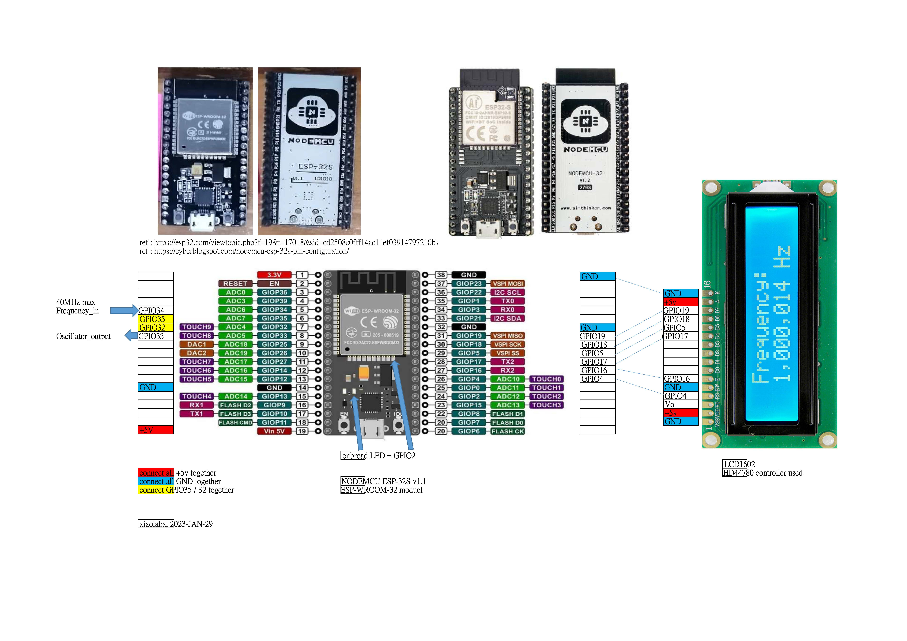
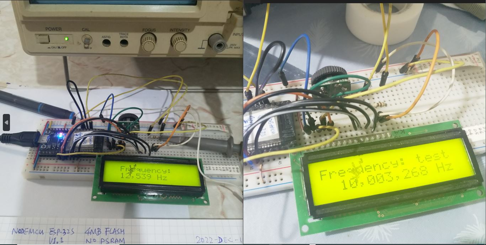

# ESP32_NODEMCU_ESP-32S_ESP32-WROOM-32_40MHZ-frequency_counter
testing ESP32 40MHZ frequency counter ESP32C3 has no PCNT module, will not work

there are 2 incidents and similar design  
// ref: http://tentaratartar.blogspot.com/2022/05/esp32-arduino-frequency-counter.html  
// ref: https://esp32.com/viewtopic.php?f=19&t=17018&sid=cd2508c0fff14ac11ef03914797210b7  

testing with old board ESP32-S V1.1 NODEMCU  

  

### why and how ?
  
